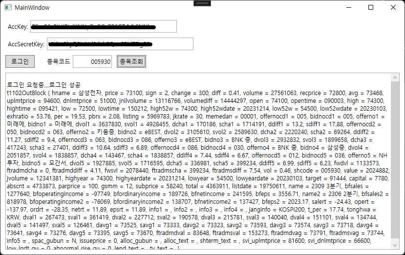

# [](https://badge.fury.io/nu/eBEST.OpenApi) eBEST.OpenApi C# Wrapper

eBEST.OpenApi는 eBEST OpenAPI를 C#에서 사용하기 위한 Wrapper입니다.

## 개발환경
Visual Studio 2022, NET48, NET8.0
<br/>
(DeveCenter 프로젝트 https://github.com/teranum/eBEST.OpenApi.DevCenter)
## 사용법

### 1. eBEST.OpenApi nuget 패키지를 참조 합니다.
	* InOutBlocks, TR Models 확장 용 사용 시에는 eBEST.OpenApi.Models 패키지를 참조
	* 일부TR 응답 시, 매뉴얼과 실제 응답 데이터가 차이 나는 경우가 있습니다. 확인 후 사용 하시기 바랍니다.
 
### 2. eBEST.OpenApi.EBestOpenApi 클래스

```csharp
	// 프로퍼티
	ServerType: 로그인 서버 타입 (실투자, 모의투자)
	bool Connected: 서버연결상태 (true:연결, false:연결해제)
	string LastErrorMessage: 마지막 에러 메시지
	string MacAddress: MAC 주소, 법인계좌시 필수 세팅

	// 메소드
	ValueTask<bool> ConnectAsync : 비동기 로그인 요청 (true: 연결성공, false: 연결실패)
	ValueTask<bool> AddAccountRealtimeRequest : 실시간 계좌정보 요청 (true: 요청성공, false: 요청실패)
	ValueTask<bool> RemoveAccountRealtimeRequest : 실시간 계좌정보 요청 취소 (true: 요청성공, false: 요청실패)
	ValueTask<bool> AddRealtimeRequest : 실시간 요청 (true: 요청성공, false: 요청실패)
	ValueTask<bool> RemoveRealtimeRequest : 실시간 요청 취소 (true: 요청성공, false: 요청실패)
	ValueTask<bool> GetTRData : TR 요청 (true: 요청성공, false: 요청실패)
	ValueTask<(string tr_cd, string tr_cont, string tr_cont_key, string jsonResponse)> GetDataWithJsonString : JSON 요청
	long GetExpires() : 접근토큰 유효기간(초)

	// 이벤트
	OnConnectEvent : 로그인 이벤트 (로그인 성공 또는 연결해제시 발생)
	OnMessageEvent : 서버 메시지 이벤트 (서버에서 메시지를 보낼때 또는 웹소켓 메시지 타입 오류일 때 발생)
	OnRealtimeEvent : 실시간 웹소켓 이벤트 (실시간 웹소켓 메시지를 받을때 발생)

```

### 3. 클래스를 생성/로그인후 TR을 요청 합니다.

```csharp
	_client = new eBEST.OpenApi.EBestOpenApi();
	_client.OnConnectEvent += (sender, e) =>
	{
		if (e.Ok)
		{
			// 로그인 성공
		}
		else
		{
			// 로그인 실패
		}
	};

	// 로그인
	_client.ConnectAsync(AccKey, AccSecretKey);


// TR 현재가 요청 ("005930" 입력시 삼성전자 현재가 요청)
void Test(string code)
{
    t1102 주식현재가 = new()
    {
        t1102InBlock = new(code),
    };
    _client.GetTRData(주식현재가).Wait();
    if (주식현재가.t1102OutBlock != null)
    {
        ResultText += $"\r\n{주식현재가.t1102OutBlock}";
    }
}
	
```
Samples/WpfSample




## 업데이트

### version 1.3.0
MacAddress 프로퍼티 추가

비동기요청메소드 리턴 변경 : Task -> ValueTask<bool>

### version 1.2.0
net48, net8.0지원

### version 1.1.1
eBEST.OpenApi.Models 에 xml Document file 추가

### version 1.1.0
eBEST.OpenApi 에서 Models/Blocks 를 eBEST.OpenApi.Models 로 분리

### version 1.0.0
초기 eBEST.OpenApi.OpenApi nuget package 게시

